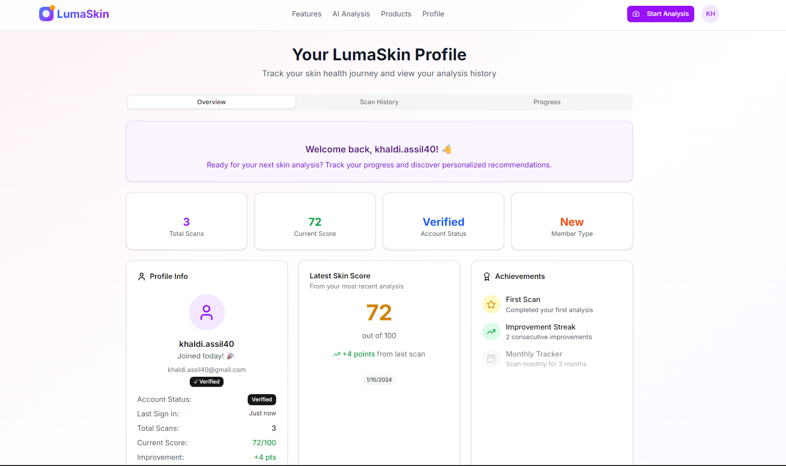
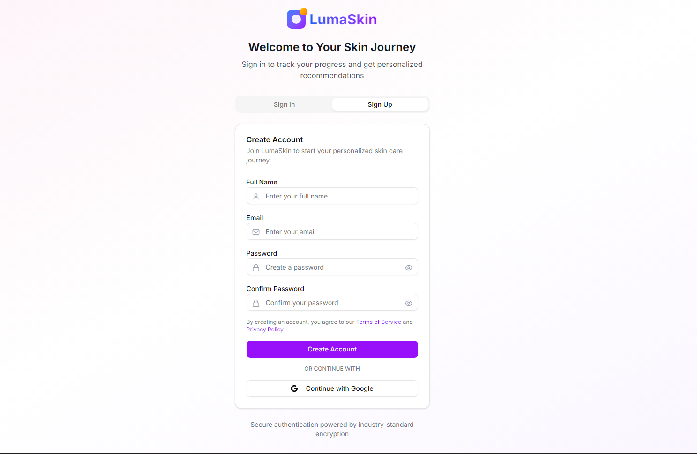
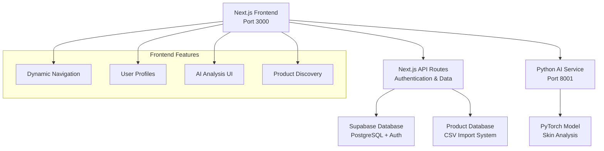

# 🧬 LumaSkin - AI-Powered Skincare Analysis Platform

<div align="center">


**Revolutionary skincare analysis powered by AI, featuring real-time skin condition detection and personalized product recommendations.**

</div>

## 📸 **Platform Screenshots**

<div align="center">

### **🏠 Homepage - Welcome to LumaSkin**


### **🤖 AI Skin Analysis - Upload & Get Results**


### **👤 User Profile - Track Your Journey**


### **🔐 Authentication - Secure User Management**


</div>

[](https://nextjs.org/)
[](https://www.typescriptlang.org/)
[](https://supabase.com/)
[](https://pytorch.org/)
[](https://tailwindcss.com/)

[🚀 Live Demo](https://lumaskin.vercel.app) • [📖 Documentation](docs/) • [🐛 Report Bug](https://github.com/Assil10/LumaSkin/issues) • [💡 Request Feature](https://github.com/Assil10/LumaSkin/issues)

</div>

## ✨ **What's New - Complete Platform Ready!**

🎉 **LumaSkin is now a full-featured skincare analysis platform!** 

### **Recent Updates:**
- ✅ **Complete Authentication System** - Secure user accounts with Supabase Auth
- ✅ **Dynamic Navigation** - Smart user menu with profile dropdown
- ✅ **User Profiles** - Personalized dashboards with skin analysis history
- ✅ **AI Integration** - Real-time skin condition detection
- ✅ **Product Database** - 1000+ products with intelligent recommendations
- ✅ **Responsive Design** - Perfect on all devices

## 🌟 **Key Features**

### **🤖 AI-Powered Skin Analysis**
- **Real-time Detection** - Upload photos or use camera for instant analysis
- **7 Skin Conditions** - acne, dryness, oily skin, rosacea, wrinkles, dark circles, normal
- **Confidence Scoring** - AI provides accuracy levels for each prediction
- **Personalized Routines** - Custom skincare recommendations based on your results
- **Product Matching** - Smart ingredient-based product suggestions

### **👤 User Management**
- **Secure Authentication** - Email/password with verification system
- **User Profiles** - Track your skin health journey over time
- **Analysis History** - View all your previous skin scans and progress
- **Account Dashboard** - Comprehensive profile with stats and achievements
- **Email Verification** - Secure account confirmation system

### **🛍️ Smart Product Discovery**
- **Comprehensive Database** - 1000+ real skincare products
- **Advanced Filtering** - Search by category, skin type, concerns, price range
- **Ingredient Analysis** - Detailed ingredient breakdown for each product
- **AI Recommendations** - Products matched to your specific skin conditions
- **Real-time Updates** - Dynamic product catalog with CSV import system

### **🎨 Modern User Experience**
- **Dynamic Navigation** - Context-aware menu that adapts to login state
- **User Avatar Menu** - Quick access to profile, settings, and logout
- **Responsive Design** - Seamless experience on desktop, tablet, and mobile
- **Beautiful UI** - Built with shadcn/ui components and Tailwind CSS
- **Accessibility First** - WCAG compliant design for all users

## 🏗️ **System Architecture**



## 🛠️ **Tech Stack**

<table>
<tr>
<td>

**Frontend**
- Next.js 15
- React 19
- TypeScript
- Tailwind CSS
- shadcn/ui

</td>
<td>

**Backend**
- Next.js API Routes
- Supabase Auth
- PostgreSQL
- Row Level Security
- Real-time subscriptions

</td>
<td>

**AI/ML**
- Python FastAPI
- PyTorch
- EfficientNet-B0
- PIL/OpenCV
- Real-time inference

</td>
</tr>
</table>

## 🚀 **Quick Start**

### **Prerequisites**
- Node.js 18+
- Python 3.11+
- Git
- Supabase account

### **1. Clone Repository**
```bash
git clone https://github.com/Assil10/LumaSkin.git
cd LumaSkin
npm install
```

### **2. Environment Setup**
Create `.env.local` in project root:
```env
NEXT_PUBLIC_SUPABASE_URL=your_supabase_project_url
NEXT_PUBLIC_SUPABASE_ANON_KEY=your_supabase_anon_key
```

### **3. Database Setup**
1. Create a new Supabase project
2. Go to SQL Editor in your Supabase dashboard
3. Run the complete setup script from `scripts/supabase-setup.sql`
4. Import your products data using the CSV import feature

### **4. AI Service Setup**
```bash
cd ai-service
python -m venv venv
venv\Scripts\Activate.ps1  # Windows
# or: source venv/bin/activate  # macOS/Linux
pip install -r requirements.txt
```

### **5. Start the Platform**

#### **Option A: Automated (Recommended)**
```bash
# Windows PowerShell
.\start-ai-system.ps1

# Windows Command Prompt
.\start-ai-system.bat
```

#### **Option B: Manual**
```bash
# Terminal 1: AI Service
cd ai-service
python app.py

# Terminal 2: Next.js App
npm run dev
```

### **6. Access Your Platform**
- **Main App**: http://localhost:3000
- **AI Service**: http://localhost:8001
- **AI Analysis**: http://localhost:3000/ai-skin-analysis

## 🧪 **Using the Platform**

### **1. Create Account**
1. Navigate to http://localhost:3000
2. Click "Sign In" in the navigation
3. Switch to "Sign Up" tab
4. Enter your email and password
5. Check your email for verification link

### **2. Explore Features**
- **AI Analysis**: Upload skin photos for instant analysis
- **Products**: Browse 1000+ skincare products with smart filtering
- **Profile**: View your analysis history and account details
- **Navigation**: Click your avatar for user menu options

### **3. AI Skin Analysis**
1. Go to "AI Analysis" from navigation
2. Upload an image or use camera capture
3. Get instant AI predictions with confidence scores
4. View personalized skincare routines
5. See product recommendations based on your results

## 📊 **Features Showcase**

### **Dynamic Navigation System**
```typescript
// Smart navigation that adapts to user state
{user ? (
  <UserMenu user={user} />  // Shows avatar with dropdown
) : (
  <AuthButtons />          // Shows Sign In button
)}
```

### **AI Analysis Pipeline**
```python
# Real-time skin condition detection
predictions = model.predict(uploaded_image)
recommendations = get_skincare_routine(predictions)
products = match_products_by_ingredients(recommendations)
```

### **Database Integration**
```sql
-- Advanced product filtering with RLS
SELECT * FROM products 
WHERE skin_type @> ARRAY['Oily'] 
AND concerns @> ARRAY['Acne']
AND price BETWEEN 10 AND 50;
```

## 📁 **Project Structure**

```
LumaSkin/
├── 📱 app/                     # Next.js App Router
│   ├── 🔐 auth/              # Authentication pages
│   ├── 🤖 ai-skin-analysis/  # AI analysis interface
│   ├── 🛍️ products/          # Product discovery
│   ├── 👤 profile/           # User dashboard
│   └── 🔌 api/               # Backend API routes
├── 🤖 ai-service/             # Python AI microservice
│   ├── 📊 app.py             # FastAPI application
│   ├── 🧠 models/            # AI model files
│   └── 📋 requirements.txt   # Python dependencies
├── 🧩 components/             # React components
│   ├── 🧭 navigation.tsx     # Dynamic navigation
│   ├── 🔒 auth-guard.tsx     # Route protection
│   └── 🎨 ui/                # shadcn/ui components
├── 📚 lib/                    # Utilities & configs
│   ├── 🗄️ supabase-client.ts # Database client
│   └── 🔧 utils.ts           # Helper functions
├── 📜 scripts/               # Setup scripts
│   └── 🗃️ supabase-setup.sql # Database schema
└── 🚀 start-ai-system.*     # Launch scripts
```

## 🔧 **Configuration**

### **Authentication Setup**
The platform uses Supabase Auth with automatic profile creation:
- Email/password authentication
- Email verification system
- Row Level Security for data protection
- Automatic user profile generation

### **AI Model Configuration**
```python
# ai-service/app.py
MODEL_CONFIG = {
    "model_path": "models/best_model.pth",
    "labels_path": "models/labels.json",
    "recommendations_path": "models/recommendations.yaml"
}
```

### **Database Schema**
```sql
-- Core tables
products: id, name, brand, price, rating, category, skin_type[], concerns[], clean_ingreds[]
profiles: id, email, created_at, updated_at
```

## 🚀 **Deployment**

### **Frontend (Vercel)**
```bash
npm run build
vercel --prod
```

### **AI Service (Railway/Heroku)**
```bash
cd ai-service
pip install -r requirements.txt
uvicorn app:app --host 0.0.0.0 --port $PORT
```

### **Database (Supabase)**
- Automatic scaling and backups
- Global CDN for fast access
- Built-in authentication system

## 📈 **Performance Metrics**

| Metric | Performance |
|--------|------------|
| Frontend Load Time | < 2 seconds |
| AI Analysis Speed | < 3 seconds |
| Database Queries | < 100ms avg |
| User Registration | < 1 second |
| Product Search | < 200ms |

## 🔮 **Roadmap**

- [ ] **Settings Page** - User preferences and customization
- [ ] **Advanced Analytics** - Detailed skin health tracking
- [ ] **Mobile App** - React Native implementation
- [ ] **Social Features** - Product reviews and ratings
- [ ] **Multi-language** - International support
- [ ] **Premium Features** - Advanced AI analysis

## 🤝 **Contributing**

We welcome contributions! Please see our [Contributing Guide](CONTRIBUTING.md) for details.

1. Fork the repository
2. Create a feature branch (`git checkout -b feature/amazing-feature`)
3. Commit your changes (`git commit -m 'Add amazing feature'`)
4. Push to the branch (`git push origin feature/amazing-feature`)
5. Open a Pull Request

## 📚 **Documentation**

- [🔧 AI Integration Setup](AI_INTEGRATION_SETUP.md)
- [🗄️ Database Schema](docs/database.md)
- [🔌 API Reference](docs/api.md)
- [🎨 Component Library](docs/components.md)

## 🐛 **Troubleshooting**

<details>
<summary><strong>Common Issues & Solutions</strong></summary>

### **Authentication Issues**
```bash
# Check environment variables
echo $NEXT_PUBLIC_SUPABASE_URL
echo $NEXT_PUBLIC_SUPABASE_ANON_KEY
```

### **AI Service Won't Start**
```bash
# Verify Python environment
python --version
pip list | grep torch
```

### **Database Connection Errors**
```bash
# Test Supabase connection
curl "https://your-project.supabase.co/rest/v1/"
```

</details>

## 📄 **License**

This project is licensed under the MIT License - see the [LICENSE](LICENSE) file for details.

## 🙏 **Acknowledgments**

- **Supabase Team** - For the amazing backend platform
- **Vercel Team** - For the incredible deployment experience
- **shadcn/ui** - For the beautiful component library
- **PyTorch Community** - For the powerful AI framework

## 📞 **Support & Community**

- 🐛 **Bug Reports**: [GitHub Issues](https://github.com/Assil10/LumaSkin/issues)
- 💬 **Discussions**: [GitHub Discussions](https://github.com/Assil10/LumaSkin/discussions)
- 📧 **Email**: [Contact Us](mailto:support@lumaskin.com)

---

<div align="center">

**⭐ Star this repository if you find it helpful!**

**🚀 Ready to revolutionize skincare with AI? [Get Started Now!](https://github.com/Assil10/LumaSkin)**

</div>